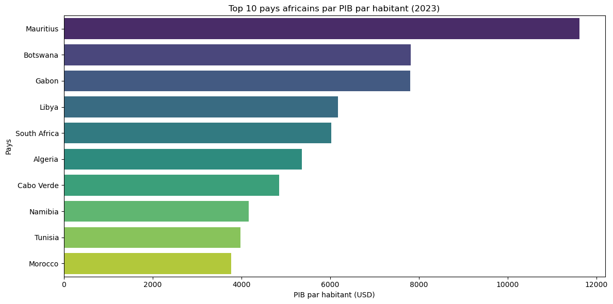
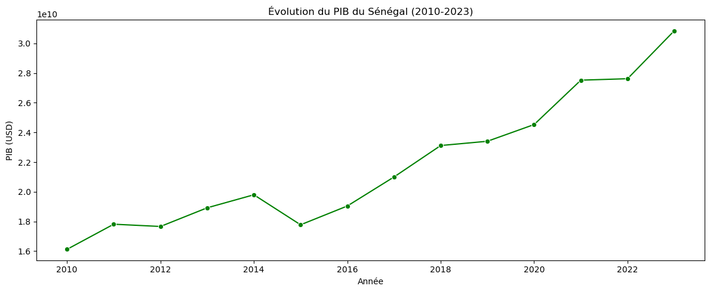
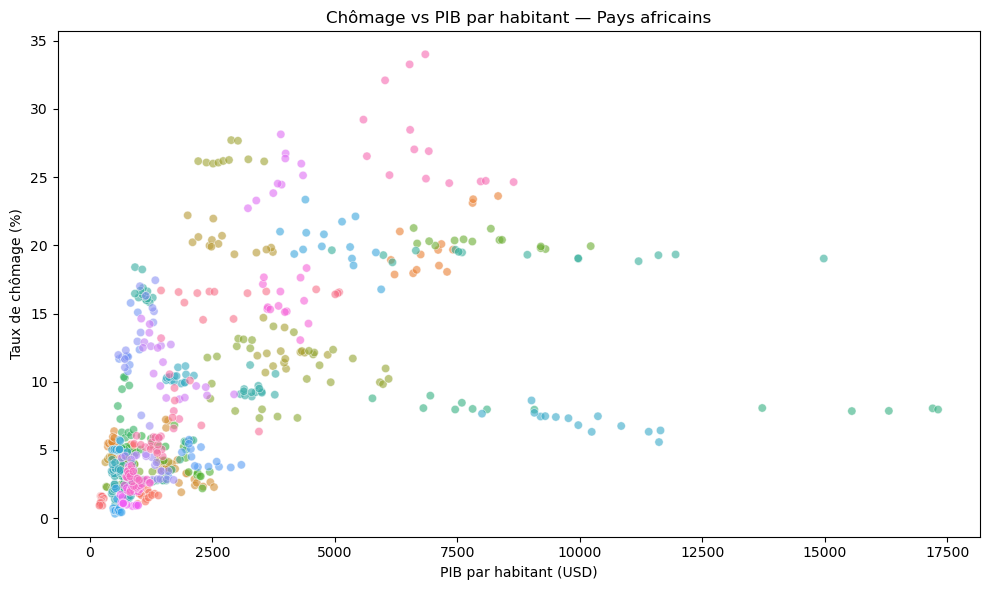
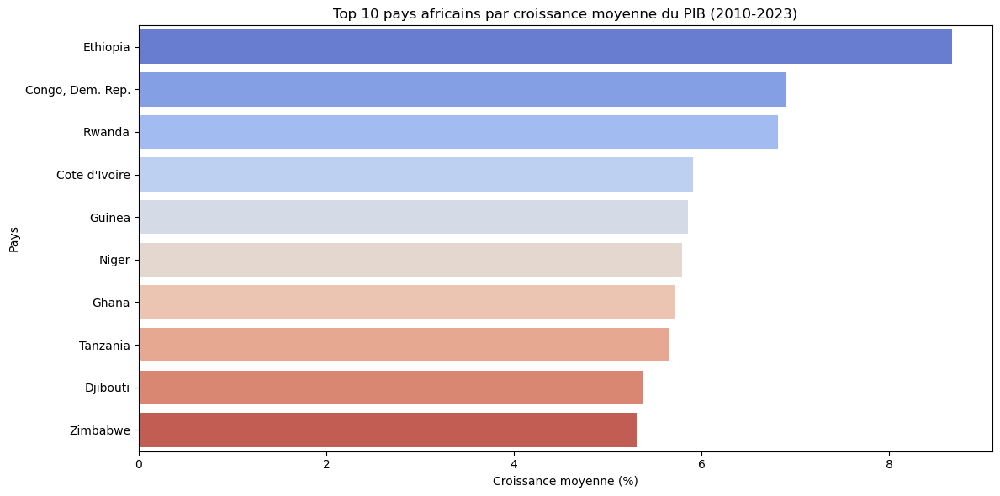

# 📊 Analyse Exploratoire — Indicateurs Économiques Africains


> Analyse exploratoire de données (EDA) portant sur les indicateurs macroéconomiques
> de **53 pays africains** sur la période **2010–2023**, basée sur les données officielles
> de la Banque Mondiale.

---

##  Table des matières

- [Description](#-description)
- [Objectifs](#-objectifs)
- [Visualisations](#-visualisations)
- [Insights clés](#-insights-clés)
- [Structure du projet](#-structure-du-projet)
- [Installation](#-installation)
- [Source des données](#-source-des-données)
- [Auteur](#-auteur)
- [Licence](#-licence)

---

##  Description

Ce projet constitue le **premier projet personnel** de mon portfolio Data et IA.
Il s'agit d'une analyse exploratoire complète visant à comprendre les dynamiques
économiques du continent africain à travers cinq indicateurs clés :
PIB par habitant, croissance du PIB, taux d'inflation, taux de chômage
et population.

---

##  Objectifs

- Explorer et nettoyer un jeu de données macroéconomiques réel (Banque Mondiale)
- Visualiser les disparités économiques entre les pays africains
- Identifier les tendances de croissance et d'inflation sur 13 ans
- Mettre en évidence les pays les plus performants et les plus fragiles

---

<<<<<<< HEAD
##  Structure du projet
projet-eda-afrique/

- analyse.ipynb    # Notebook principal
- data.csv         # Dataset Banque Mondiale
- README.md        # Ce fichier
=======
##  Visualisations

### Top 10 pays par PIB par habitant (2023)


### Évolution du PIB du Sénégal (2010–2023)


### Comparaison de l'inflation — 5 grands pays


### Relation entre chômage et PIB par habitant


### Top 10 pays par croissance moyenne du PIB


---
>>>>>>> d133623 (feat: ajout .gitignore, requirements.txt et README professionnel)

##  Insights clés

| Indicateur | Résultat |
|---|---|
|  PIB/hab le plus élevé (2023) | **Maurice** domine largement le continent |
|  Croissance moyenne la plus forte | **Éthiopie** affiche la dynamique la plus soutenue |
|  Inflation la plus instable | **Égypte** avec de fortes variations sur la période |
|  Limites du taux de chômage | Ne reflète pas la réalité à cause du **secteur informel** dominant |

---

##  Structure du projet

```
analyse_data_world_bank/
│
├── .gitignore            # Fichiers exclus du suivi Git
├── README.md             # Documentation du projet
├── requirements.txt      # Dépendances Python
├── analyse.ipynb         # Notebook principal (EDA complète)
│
└── images/
    ├── top10_pib.png
    ├── senegal_gdp.png
    ├── inflation_comparaison.png
    ├── correlation_chomage_pib.png
    └── top10_croissance.png
```

---

##  Installation

```bash
# 1. Cloner le dépôt
git clone https://github.com/cdoumb/analyse_data_world_bank.git
cd analyse_data_world_bank

# 2. Créer un environnement virtuel (recommandé)
python -m venv venv
source venv/bin/activate  # Sur Windows : venv\Scripts\activate

# 3. Installer les dépendances
pip install -r requirements.txt

# 4. Télécharger les données
# Lien Kaggle : https://www.kaggle.com/datasets/...
# Placer le fichier téléchargé à la racine sous le nom data.csv

# 5. Lancer le notebook
jupyter notebook analyse.ipynb
```

---

##  Source des données
<<<<<<< HEAD 
World Bank Open Data via Kaggle
=======

- **Fournisseur :** [World Bank Open Data](https://data.worldbank.org/)
- **Source d'accès :** [Kaggle – World Bank African Indicators](https://www.kaggle.com/)
- **Période couverte :** 2010–2023
- **Pays couverts :** 53 pays africains

>  Le fichier `data.csv` n'est **pas inclus** dans ce dépôt (voir `.gitignore`).
> Veuillez le télécharger depuis le lien Kaggle ci-dessus.

---

##  Auteur

**Cheick Oumar DOUMBIA**
Étudiant en Data & IA — ESMT Dakar

[](https://www.linkedin.com/in/cheick-oumar-doumbia-77991b3a0)
[](https://github.com/cdoumb)

---

##  Licence

Ce projet est sous licence [MIT](https://opensource.org/licenses/MIT).
>>>>>>> d133623 (feat: ajout .gitignore, requirements.txt et README professionnel)
